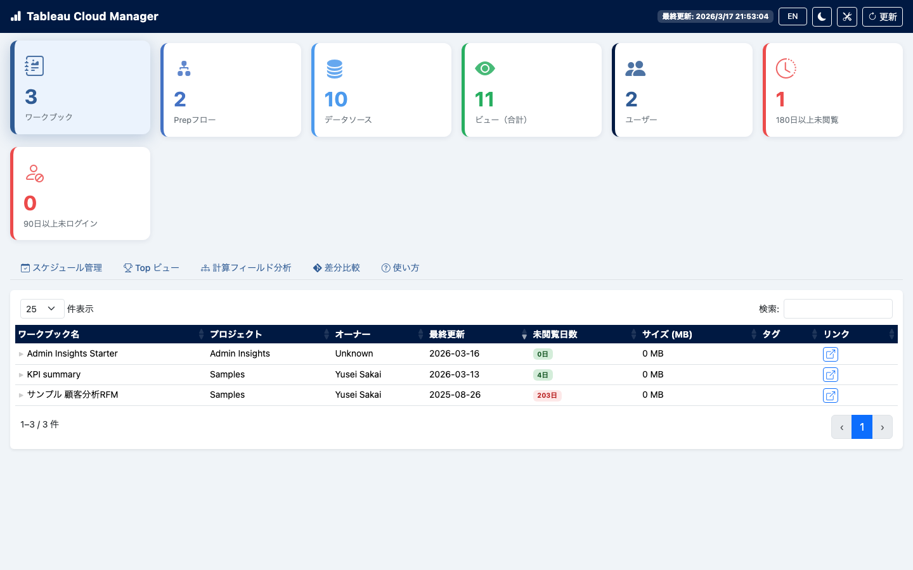
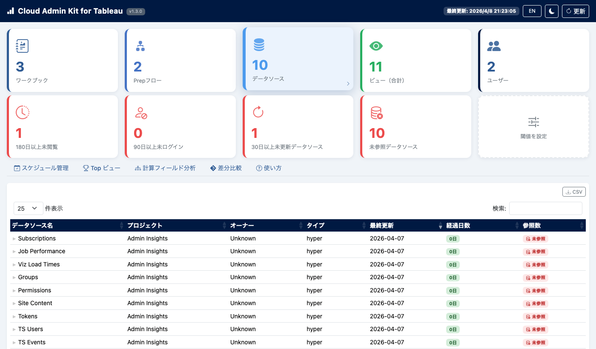
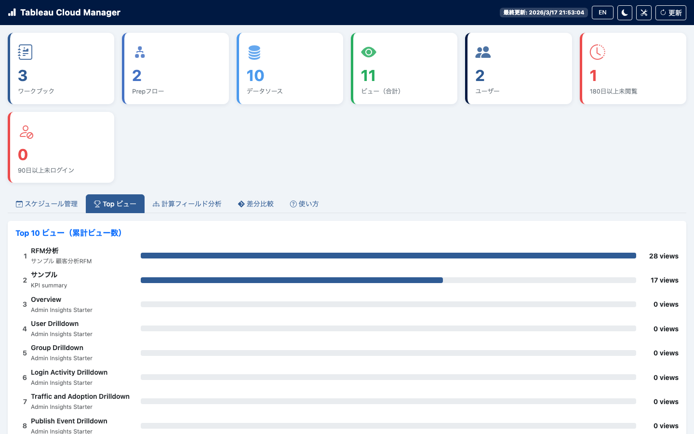
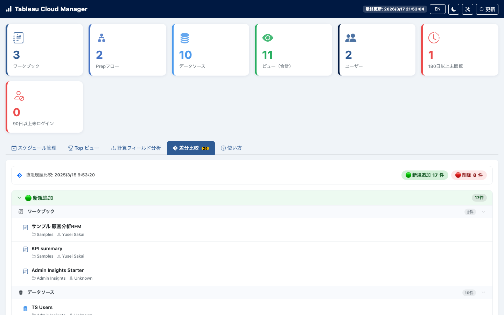
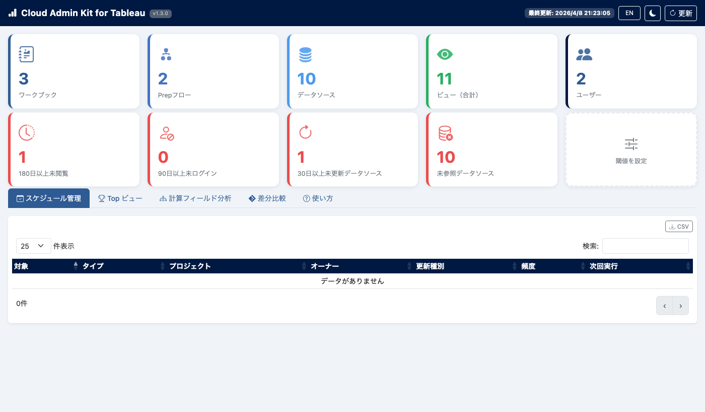
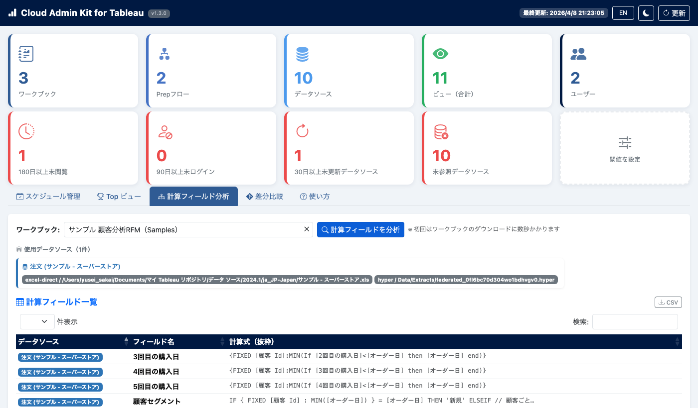
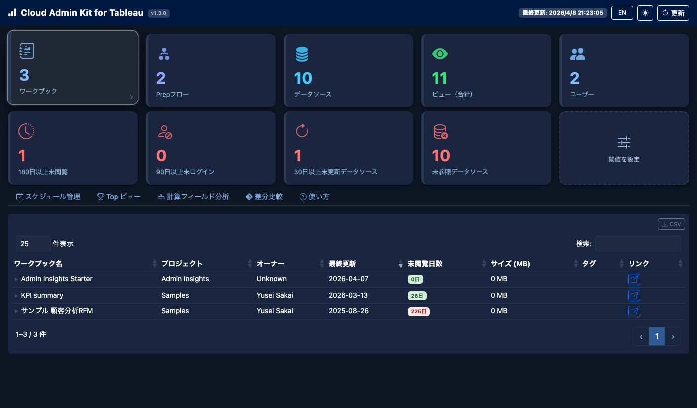

# Cloud Admin Kit for Tableau

[](LICENSE)
[](https://www.python.org/)

> **日本語版 README**: [README_ja.md](README_ja.md)

A local web app for **centralized management, change tracking, and maintenance efficiency** of your Tableau Cloud site — built with Python + FastAPI, running entirely on your machine.

---

## Why This Tool?

Tableau Cloud's admin screens are spread across multiple pages. Answering questions like "Which data sources are used by which dashboards?", "What changed since yesterday?", or "Who hasn't logged in for months?" requires navigating between many different views.

**Cloud Admin Kit for Tableau** consolidates the information administrators actually need for day-to-day maintenance into a single screen, preventing missed changes before they become problems.

---

## Key Value

### 1. Full Site Overview at a Glance



Open the app and instantly see the state of your entire site across two rows of summary cards.

**Top row — site totals:**
- **Workbooks / Prep Flows / Data Sources / Views / Users**

**Bottom row — alert cards (counts update instantly when thresholds change):**
- **Not Viewed N+ Days** — content candidates for cleanup
- **Inactive N+ Days** — users for license optimization
- **DS Not Updated N+ Days** — data sources whose extracts may be stale
- **Unreferenced Data Sources** — published data sources used by no workbook
- **⚙ Set Thresholds** — customize the N-day alert thresholds per-person, saved to browser storage

Click any card to jump directly to the relevant list tab.

---

### 2. Data Source & Dashboard Relationships



The Data Sources tab shows each source's **project, owner, type, certification status, and days since last update** in one sortable table.

- Red-highlighted stale data sources are instantly visible
- **Unreferenced** badge flags any data source that no workbook currently connects to — a clear cleanup candidate
- Expand any row to see which workbooks reference that data source
- Certification status managed in a single column for audit purposes

---

### 3. Content Usage Rankings



Bar chart of the top 10 most-viewed content on your site.

- Immediately see which dashboards matter most to users
- Use this to prioritize maintenance effort and decide what to retire

---

### 4. Automatic Daily Change Tracking



Automatically detects what changed between yesterday's snapshot and today's data.

- 🟢 **New**: workbooks, data sources, flows, or users that didn't exist before
- 🟡 **Updated**: name, project, or owner changes
- 🔴 **Deleted**: content that existed yesterday but is gone today
- Workbooks tagged **KTW** are also monitored for calculated field additions, deletions, and formula changes

Tableau Cloud has no built-in change notifications. This tab gives you a daily audit trail — if someone accidentally deletes a workbook or makes an unauthorized change, **you'll know the next day**.

---

### 5. Extract Refresh Schedule Monitoring



Keep data fresh by monitoring all extract refresh schedules.

- See every refresh schedule with its next run time
- **Overdue** badge highlights schedules where the next run time has already passed — a sign of a stalled or failed refresh

---

### 6. Workbook Revision Diff Comparison

Compare any two revisions of a workbook side-by-side to pinpoint exactly what changed.

- Select a workbook and choose **Base** and **Head** revision numbers
- See **added / deleted / changed** for:
  - **Calculated fields** — field name, datasource, and old vs. new formula for changes
  - **Filters** — categorical, quantitative, relative-date, and top-N filters
  - **Connected datasources** — datasource additions and removals
  - **Sheets** — worksheet, dashboard, and story additions and removals
- Results are cached per revision pair — instant on second view
- Catch unauthorized formula edits by comparing the current revision against the previous one

---

### 7. Calculated Field Dependency Analysis



Download and analyze a workbook's calculated fields, visualized as a Sankey dependency chart.

- Understand which calculated fields depend on which others
- Invaluable when maintaining or handing off complex workbooks

---

### 8. Background Auto-Refresh

The app automatically re-fetches data from Tableau Cloud in the background at a configurable interval (default: **every 30 minutes**). The cache is updated without any user action — the UI always shows near-current data.

- Set `REFRESH_INTERVAL_MINUTES` in `.env` to adjust the interval (minimum 15 min recommended to stay within API rate limits)
- The status bar shows the last fetched timestamp so you always know how fresh the data is
- In-progress fetches are never duplicated — a new fetch is skipped if one is already running

---

### 9. Configurable Alert Thresholds

Click the **⚙ Set Thresholds** card (bottom-right of the dashboard) to customize the alert day counts:

| Alert card | Default | What it counts |
|---|---|---|
| Not Viewed | 180 days | Workbooks with no view activity beyond the threshold |
| Inactive users | 90 days | Users who haven't logged in beyond the threshold |
| DS Not Updated | 30 days | Data sources whose last-updated date exceeds the threshold |

Thresholds are saved per-browser in `localStorage` and take effect immediately — no server restart needed.

---

### 10. Dark Mode & Bilingual UI



Toggle between light and dark mode for comfortable long sessions. Full Japanese / English language switching is supported throughout the UI.

---

## Getting Started

```bash
git clone https://github.com/brave-data/Cloud_Admin_Kit_for_Tableau.git
cd Cloud_Admin_Kit_for_Tableau
python3 -m venv .venv && source .venv/bin/activate   # requires Python 3.11+
pip install -r requirements.txt
cp .env.example .env   # add your Tableau Cloud credentials
python main.py
```

Then open **http://localhost:8000** and click **↻ Refresh**.

**→ Full setup instructions, PAT creation steps, and troubleshooting: [SETUP.md](SETUP.md)**

---

## KTW Tag — Calculated Field Monitoring

Tag any workbook with `KTW` in Tableau Cloud to enable automatic calculated field monitoring.

- On every **Refresh**, the app downloads up to **10 KTW-tagged workbooks** and extracts their calculated fields
- Field additions, deletions, and formula changes appear in the **Changes tab** under "Calc Fields [KTW Watch]"
- Catch unauthorized or accidental formula edits the next day, automatically

---

## API Endpoints

Swagger UI is available at `http://localhost:8000/docs` while the app is running.

| Endpoint | Description |
|----------|-------------|
| `GET /api/status` | Fetch status, last updated timestamp, and any partial-fetch warnings |
| `GET /api/summary` | Site-wide summary statistics |
| `GET /api/workbooks` | Workbook list |
| `GET /api/datasources` | Data source list (includes `is_ghost` flag) |
| `GET /api/views` | View list with usage counts |
| `GET /api/users` | User list |
| `GET /api/flows` | Prep flow list |
| `GET /api/schedules` | Refresh schedule list |
| `GET /api/flows/{id}/connections` | Input/output connections for a Prep flow |
| `GET /api/workbooks/{id}/fields` | Calculated field analysis for a workbook |
| `GET /api/workbooks/{id}/revisions` | Revision history for a workbook |
| `GET /api/workbooks/{id}/revision-diff` | Diff between two revisions (`?base=N&head=M`; omit for latest vs. previous) |
| `GET /api/ktw-fields` | Calculated fields for all KTW-tagged workbooks (up to 10) |
| `POST /api/refresh` | Trigger data re-fetch from Tableau Cloud |

---

## File Structure

```
Tableau_Cloud_Manager/
├── main.py                  # FastAPI server (entry point)
├── tableau_client.py        # Tableau Cloud REST API client
├── content_audit.py         # Standalone content health report script
├── requirements.txt         # Python dependencies
├── .env.example             # Environment variable template
├── .gitignore               # Excludes .env and venv from Git
├── README.md                # This file (English)
├── README_ja.md             # Japanese README
├── SETUP.md                 # Full setup guide (English)
├── SETUP_ja.md              # Full setup guide (Japanese)
├── docs/screenshots/        # UI screenshots for README
└── static/
    └── index.html           # Single-page UI (Bootstrap 5 + DataTables)
```

---

## Tech Stack

- **Backend**: Python 3.11+, FastAPI, uvicorn, tableauserverclient, APScheduler
- **Frontend**: Bootstrap 5.3, Bootstrap Icons, DataTables 1.13, D3.js (Sankey)
- **Data persistence**: Browser `localStorage` for diff snapshots and alert thresholds
